# Моделирование нагрева кота от батареи

В этой работе я попробовала построить трёхмерную модель кота, сгенерировать для неё сетку и решить задачу теплопереноса методом конечных элементов.

Основная идея проекта заключалась в том, чтобы посмотреть, как кот нагревается от батареи, если учитывать не только внешнее тепло, но и внутренние физиологические процессы: температуру крови, сердце и упрощённую сосудисто-перфузионную область.

Также были рассмотрены несколько режимов: расчёт без батареи, нагрев в комнатных условиях и нагрев при холодной внешней среде. Это позволяет сравнить, как меняется температура кота при разных условиях теплообмена.

Для работы используются:

* **Gmsh** — для построения геометрии и генерации тетраэдральной сетки;
* **FEniCSx / DOLFINx** — для решения уравнения теплопереноса;
* **ParaView** — для просмотра температуры, сетки и внутренних областей.

---

## Содержание

* [Идея задачи](#идея-задачи)
* [Проблемы с STL-моделью](#проблемы-с-stl-моделью)
* [Геометрия кота](#геометрия-кота)
* [Сетка](#сетка)
* [Физическая модель](#физическая-модель)
* [Режимы нагрева](#режимы-нагрева)
* [Температура нагрева](#температура-нагрева)
* [Примеры запуска](#примеры-запуска)
* [Запуск проекта](#запуск-проекта)
* [Просмотр результатов](#просмотр-результатов)
* [Результаты](#результаты)
* [Ограничения модели](#ограничения-модели)

---

## Идея задачи

Я хотела сделать не просто абстрактную задачу теплопроводности, а небольшую физическую модель с понятным объектом. Поэтому в качестве объекта был выбран кот, лежащий на батарее.

В модели присутствуют:

* тело кота;
* отдельная область сердца;
* сосудисто-перфузионная область, идущая от сердца к лапам;
* внешняя среда;
* область контакта с батареей снизу.

Температура считается во времени. В разных режимах можно менять условия: например, оставить только внутреннее тепло, поместить кота в комнату рядом с батареей или рассмотреть холодную внешнюю среду.

Такая модель может быть полезна как учебный пример биотеплопереноса. Она показывает, как внешнее тепло, теплоотдача в окружающую среду и кровоток вместе влияют на температуру биологического объекта. В реальных задачах похожий подход можно использовать для оценки нагрева тканей, влияния теплоизоляции или сравнения разных условий окружающей среды. В этом проекте модель упрощена, поэтому её результат нужно рассматривать как качественную демонстрацию.

---

## Проблемы с STL-моделью

Сначала я хотела взять готовую STL-модель кота и построить по ней объёмную сетку. Я пробовала импортировать модель в Gmsh и получить тетраэдральную сетку, но с этим возникли проблемы.

Готовая STL-модель оказалась неудобной для расчётной задачи, поскольку при построении объёмной сетки появлялись ошибки, связанные с геометрией. Такие модели часто хорошо выглядят визуально, но могут содержать самопересечения, незамкнутые участки или слишком сложную топологию.

Я также пробовала исправлять модель в **Blender**, но получить устойчивую объёмную сетку для расчёта не получилось. После этого я решила пойти другим путём и построить кота с помощью **кода на C++**.

У такого подхода появились ограничения. Из-за того, что геометрия строится кодом из простых примитивов (эллипсоиды и "капсулы"), а не берётся из готовой детализированной модели, не получилось отдельно и подробно задать слой шерсти. В этой версии проекта шерсть учитывается упрощённо — через коэффициент теплообмена на внешней поверхности.

Также я сначала хотела задать сердечно-сосудистую систему более явно: например, как граф сосудов, проходящий от сердца к разным частям тела. Однако при попытке добавить тонкие сосудистые объёмы внутрь геометрии сетка становилась неустойчивой, и модель не удавалось нормально замешить. Поэтому в итоговой версии сосуды заданы как упрощённая сосудисто-перфузионная область по ячейкам сетки.

В результате модель получилась менее детализированной визуально.

Изначально была идея взять готовую STL-модель кота:

<p align="center">
  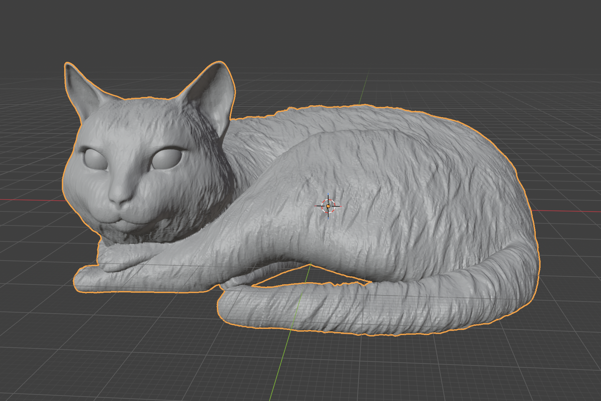
  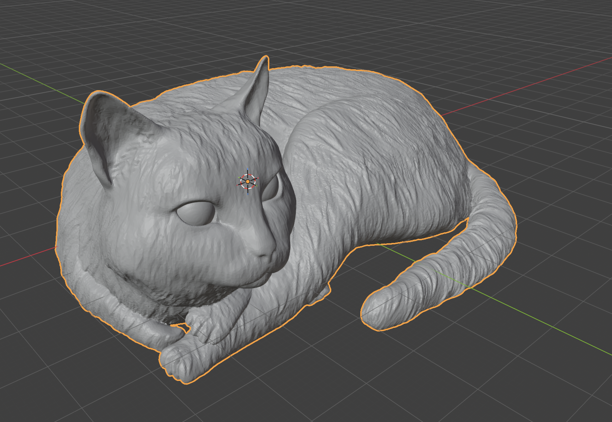
</p>

<p align="center">
  <em>STL-модель кота, которую я сначала пыталась использовать для построения объёмной сетки.</em>
</p>

Эта модель выглядела намного более реалистично: у неё была детализированная форма тела, морды, ушей и шерсти.

---

## Геометрия кота

Геометрия строится в файле [cat_geometry.cpp](./codes/cat_geometry.cpp).

После неудачной попытки с STL-моделью я стала задавать геометрию вручную. Для этого я использовала простые объёмные примитивы Gmsh: эллипсоиды и капсулы. Каждый элемент кота задаётся координатами, размерами и поворотами, а затем отдельные части объединяются в одну модель.

<p align="center">
  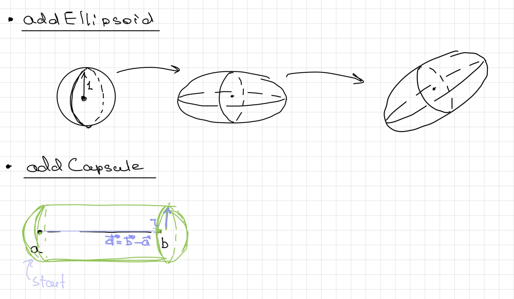<br>
  <em>Идея построения геометрии из эллипсоидов и капсул.</em>
</p>

Кот собирается из простых объёмных примитивов:

* эллипсоидов;
* капсул;
* объединений нескольких частей.

Из этих элементов строятся туловище, голова, уши, лапы и хвост. Отдельно внутри модели задаётся сердце. После построения геометрии создаются физические группы, которые потом используются в тепловой задаче.

**Пример:**

При построении отдельных частей я сначала набрасывала их схематично: где должны находиться центры примитивов, какие размеры им задать и как они должны соединяться между собой. Например, передняя лапа собиралась из нескольких капсул и эллипсоидов: основной вытянутой части, мягких подушечек и отдельных пальцев.

<p align="center">
  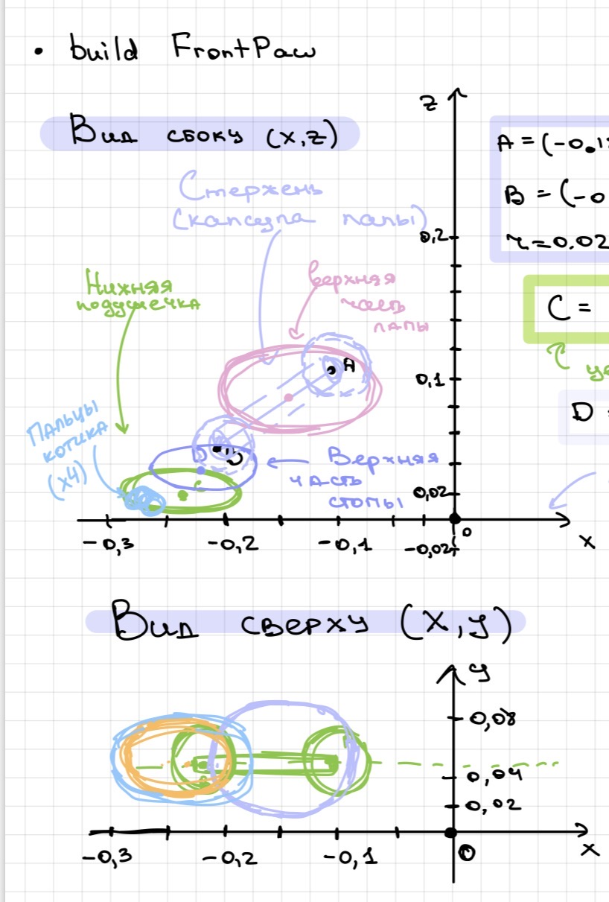
  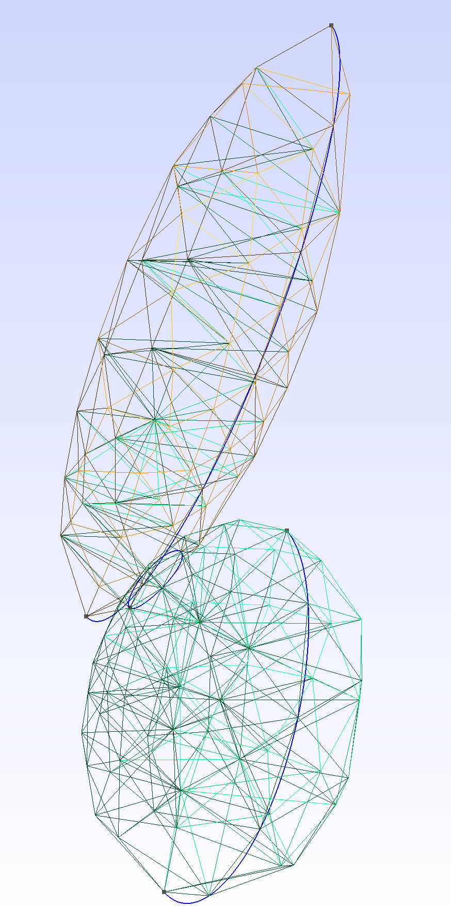
</p>

<p align="center">
  <em>Схема построения лапы и пример сетки для отдельной детали геометрии.</em>
</p>

Отдельная сложность была в том, что слишком детальные элементы быстро усложняют сетку. Например, уши, пальцы и тонкие части лапы хотелось сделать более похожими на настоящие, но при слишком большом количестве мелких деталей сетка становилась тяжелее и менее устойчивой. Поэтому я оставила форму упрощённой: достаточно узнаваемой визуально, но пригодной для построения объёмной сетки.

---

## Сетка

После построения геометрии в Gmsh генерируется объёмная тетраэдральная сетка. Генерация сетки также выполняется в файле [cat_geometry.cpp](./codes/cat_geometry.cpp).

Я использовала именно тетраэдральную сетку, потому что ей удобно заполнять объекты сложной формы. Для такой модели это важно: кот состоит из большого количества соединённых примитивов, и сетка должна корректно заполнить не только поверхность, но и внутренний объём.

Сетка сохраняется в файл: `cat_heat_model.msh`

Вместе с сеткой сохраняются физические группы объёмов, которые потом используются в тепловой задаче:

* `heart` — область сердца
* `tissue` — ткани кота

После этого сетка читается в [solve_cat_heat.py](./codes/solve_cat_heat.py) с помощью DOLFINx. Уже на стороне Python я дополнительно задаю сосудисто-перфузионную область и граничные области по ячейкам и граням сетки:

* `region_id = 1` — сердце
* `region_id = 2` — сосудисто-перфузионная область
* `region_id = 3` — остальные ткани

Сосуды в этой версии выглядят в ParaView грубее, чем настоящая сосудистая сеть, потому что они задаются по ячейкам сетки. Но для расчёта они участвуют как отдельная область с другими коэффициентами теплопереноса и перфузии.

<p align="center">
  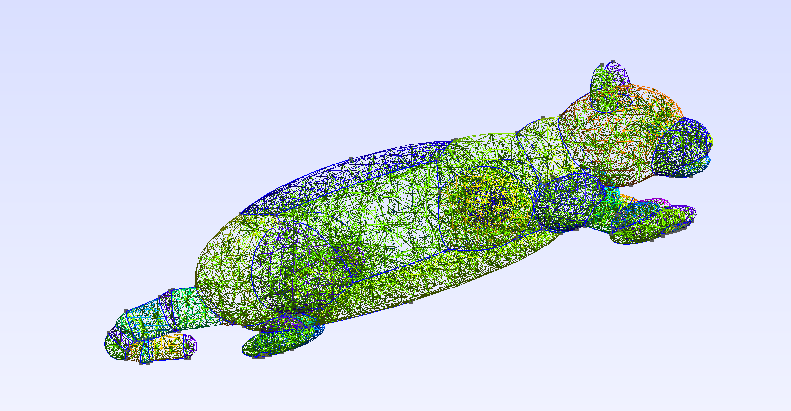
  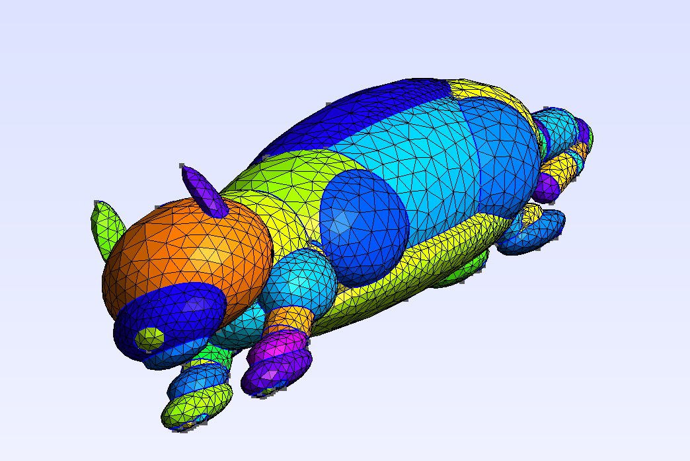
</p>

<p align="center">
  <em>Поверхностная сетка кота в Gmsh: слева видны рёбра сетки, справа — отдельные поверхности модели.</em>
</p>

---

## Физическая модель

Тепловой расчёт выполняется в файле [solve_cat_heat.py](./codes/solve_cat_heat.py).

В качестве физической модели я использовала нестационарное уравнение био-теплопереноса Пеннеса. Оно похоже на обычное уравнение теплопроводности, но дополнительно учитывает влияние крови. Это было важно для моей задачи, потому что кот не является просто однородным телом: внутри есть сердце, кровь и области с более активным теплообменом.

<p align="center">
  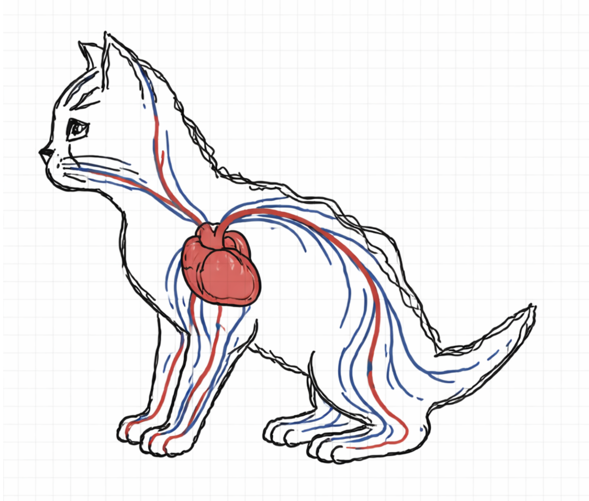<br>
  <em>Схематичная идея сердца и сосудов, которую я использовала при построении упрощённой модели.</em>
</p>

Уравнение записывается так:

$$\rho c \frac{\partial T}{\partial t} - \nabla \cdot (k \nabla T) + \beta \left(T - T_{\mathrm{blood}}\right) = Q$$

Здесь:

* $T$ — температура ткани;
* $\rho$ — плотность;
* $c$ — теплоёмкость;
* $k$ — теплопроводность;
* $Q$ — внутреннее тепловыделение;
* $\beta$ — эффективная перфузия крови;
* $T_{\mathrm{blood}}$ — температура крови.

Член $\beta \left(T - T_{\mathrm{blood}}\right)$ отвечает за влияние кровотока. Если ткань холоднее крови, кровь её подогревает. Если ткань горячее, кровь отводит тепло. Поэтому для сердца и сосудистой области я задаю отдельные значения параметров.

На внешней поверхности я не задаю температуру жёстко. Вместо этого используется условие теплообмена: чем сильнее температура поверхности кота отличается от температуры воздуха или батареи, тем сильнее идёт поток тепла через границу.

Для этого используются граничные условия Робина:

$$-k \frac{\partial T}{\partial n} = h \left(T_{\mathrm{out}} - T\right)$$

Здесь $T$ — температура поверхности кота, $T_{\mathrm{out}}$ — температура внешней среды или батареи, а $h$ — коэффициент теплообмена.

В модели различаются несколько типов поверхности:

* поверхность с шерстью — теплообмен слабее;
* тонкие части тела: лапы, уши, хвост — теплообмен сильнее;
* нижняя область контакта с батареей — нагрев от батареи.

Батарея всегда находится снизу, поэтому область нагрева выбирается по нижним фасетам сетки.

---

## Режимы нагрева

Чтобы можно было сравнивать разные условия, я вынесла параметры расчёта в отдельные JSON-файлы. Они лежат в папке [codes/modes](./codes/modes):

* [internal_only.json](./codes/modes/internal_only.json)
* [room_radiator.json](./codes/modes/room_radiator.json)
* [cold_radiator.json](./codes/modes/cold_radiator.json)

При запуске нужный режим выбирается через параметр `--mode`.

| Режим | Что моделируется | Зачем нужен |
|---|---|---|
| `internal_only` | только внутреннее тепло, без батареи и внешней среды | проверить работу сердца, сосудистой области и перфузии |
| `room_radiator` | кот в комнате рядом с батареей | основной демонстрационный режим |
| `cold_radiator` | холодная внешняя среда и тёплая батарея | стресс-тест и сравнение с комнатным режимом |

---

## Температура нагрева

В расчёте температура хранится в градусах Цельсия. В текущих режимах начальная температура кота равна `38.5`, температура крови равна `38.75`, а батарея задаётся как контактная поверхность снизу с температурой `41.0` или `42.0` в зависимости от режима.

| Параметр | Что означает | Текущие значения |
|---|---|---|
| `T_init` | начальная температура всего кота | `38.5` |
| `T_blood` | температура крови, которая участвует в члене перфузии | `38.75` |
| `T_battery` | температура батареи на нижней контактной поверхности | `41.0` в `room_radiator`, `42.0` в `cold_radiator` |
| `T_env` | температура внешней среды | `20.0` в комнатном режиме, `-15.0` в холодном режиме |

Батарея не задаёт температуру всему коту напрямую. Она действует только через нижние граничные фасеты сетки, которые попадают в область контакта. На этой поверхности используется условие Робина с коэффициентом `h_battery`.

### Примеры запуска

Примеры запуска:

```
./codes/run.sh --mesh cat_heat_model.msh --mode internal_only --out out/internal_only
./codes/run.sh --mesh cat_heat_model.msh --mode room_radiator --out out/room_radiator
./codes/run.sh --mesh cat_heat_model.msh --mode cold_radiator --out out/cold_radiator
```

## Запуск проекта

Сначала нужно собрать программу, которая создаёт геометрию и сетку. `CMakeLists.txt` лежит в папке `codes`, поэтому сборку удобно запускать оттуда:

```bash
cd codes
cmake -S . -B build
cmake --build build
./build/cat_geom -nopopup
cd ..
```

После этого появится файл сетки `codes/cat_heat_model.msh`. Тепловой расчёт запускается через Docker-скрипт [run.sh](./codes/run.sh), который использует образ DOLFINx:

```bash
./codes/run.sh --mesh cat_heat_model.msh --mode room_radiator --out out/room_radiator
```

## Просмотр результатов

Результаты можно открыть в ParaView.

После запуска в папке результата появляются два основных файла:

* `temperature_<mode>.xdmf` — температура во времени;
* `auxiliary_fields_<mode>.xdmf` — области и коэффициенты модели.

Файл `temperature_<mode>.xdmf` нужен для просмотра температуры. Его удобно открывать в ParaView и двигать ползунок времени.

Файл `auxiliary_fields_<mode>.xdmf` нужен для проверки того, как размечена модель. В нём можно смотреть:

* `region_id` — номер области;
* `k` — теплопроводность;
* `beta_perf` — коэффициент перфузии;
* `Q_internal` — внутреннее тепловыделение.

Для просмотра отдельных областей я использовала фильтр `Threshold`:

* `region_id = 0.5 .. 1.5` — сердце;
* `region_id = 1.5 .. 2.5` — сосудисто-перфузионная область;
* `region_id = 2.5 .. 3.5` — остальные ткани.

---

## Результаты

Финальный расчёт выполнялся на сетке `cat_heat_model.msh`: при чтении в DOLFINx сетка содержит 3967 узлов и 11998 элементов. Во всех режимах считался промежуток `7200` секунд с шагом `10` секунд.

После запуска были получены такие итоговые температуры:

| Режим | Средняя температура кота, °C | Ткани, °C | Сердце, °C | Сосудистая область, °C | Tmin / Tmax, °C |
|---|---:|---:|---:|---:|---:|
| `internal_only` | 38.931 | 38.925 | 39.565 | 38.911 | 38.862 / 39.828 |
| `room_radiator` | 35.278 | 35.237 | 38.268 | 35.846 | 24.074 / 38.936 |
| `cold_radiator` | 26.436 | 26.314 | 35.029 | 28.355 | -6.860 / 36.909 |

В режиме `internal_only` внешнего теплообмена нет, поэтому температура в основном определяется внутренним тепловыделением и перфузией. Сердце остаётся самой тёплой областью модели.

В режиме `room_radiator` появляется теплообмен с комнатным воздухом и контакт с батареей снизу. Из-за охлаждения внешней поверхности средняя температура кота становится ниже, чем в режиме без внешней среды, но внутренняя область около сердца остаётся теплее тканей.

В режиме `cold_radiator` холодная внешняя среда сильно охлаждает поверхность и тонкие части тела. Даже при более тёплой батарее средняя температура модели получается заметно ниже, чем в комнатном режиме.

<p align="center">
  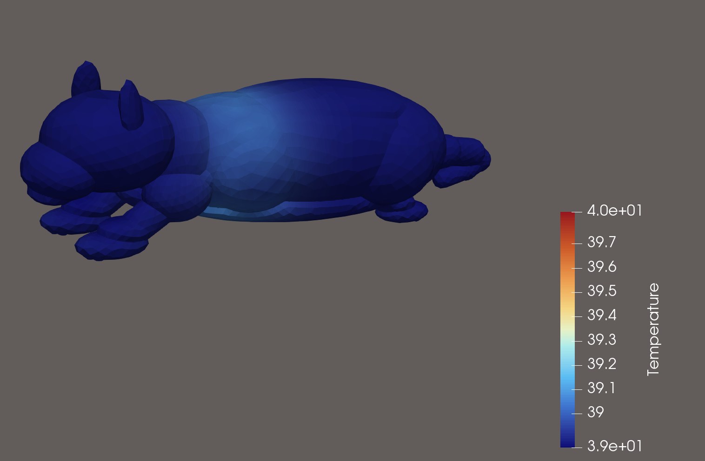<br>
  <em>Режим internal_only: температура определяется внутренним тепловыделением и перфузией, внешнего теплообмена нет.</em><br>
  <a href="https://youtu.be/G4OKVlKmd3g">Видео: internal_only</a>
</p>

<p align="center">
  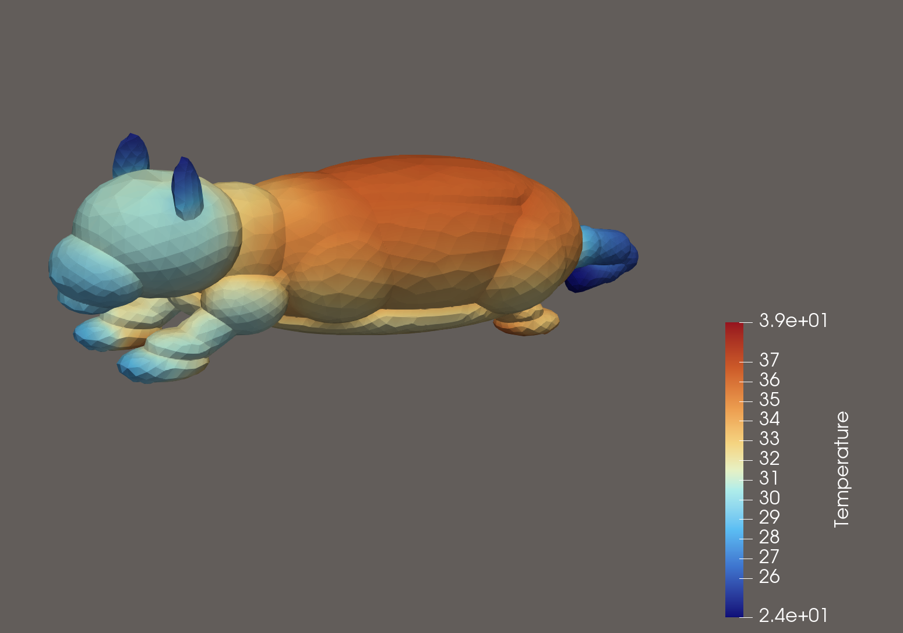<br>
  <em>Режим room_radiator: кот находится в комнате и нагревается от батареи через нижнюю контактную область.</em><br>
  <a href="https://youtu.be/uCNKr5tZhRw">Видео: room_radiator</a>
</p>

<p align="center">
  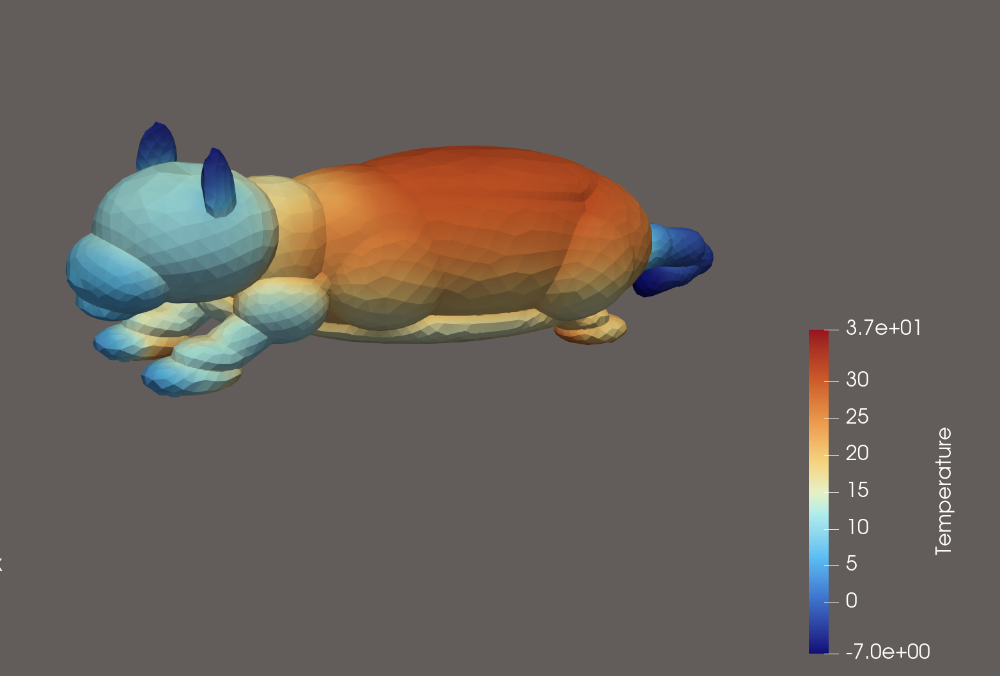<br>
  <em>Режим cold_radiator: холодная внешняя среда заметно охлаждает поверхность, лапы, уши и хвост.</em><br>
  <a href="https://youtu.be/S5RSXxIdvVE">Видео: cold_radiator</a>
</p>

<p align="center">
  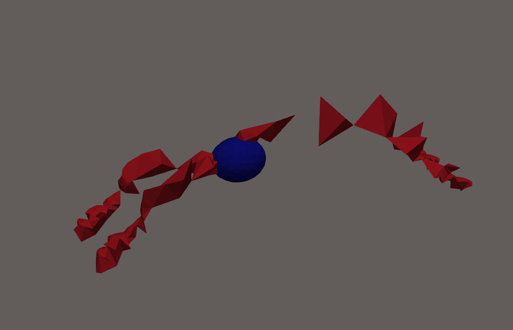<br>
  <em>Упрощённая внутренняя разметка модели: сердце и сосудисто-перфузионная область.</em>
</p>

---

## Ограничения модели

Модель является учебной и упрощённой.

Главные ограничения:

* геометрия кота не является анатомически точной
* сосуды заданы как эффективная перфузионная область, а не как настоящая сеть тонких сосудов
* параметры теплопереноса выбраны так, чтобы получить физически разумное поведение
* шерсть учитывается через уменьшенный коэффициент теплообмена, а не как отдельный геометрический слой

Тем не менее модель позволяет показать полный расчётный цикл: построение геометрии, генерацию сетки, задание физических областей, решение задачи методом конечных элементов и визуализацию результатов. 

---

<p align="center">
  <strong>Для поднятия настроения:</strong>
</p>

<p align="center">
  
  
  <br>
  <em>Коты давно знают, что батарея — это хороший источник тепла!</em>
</p>

---
